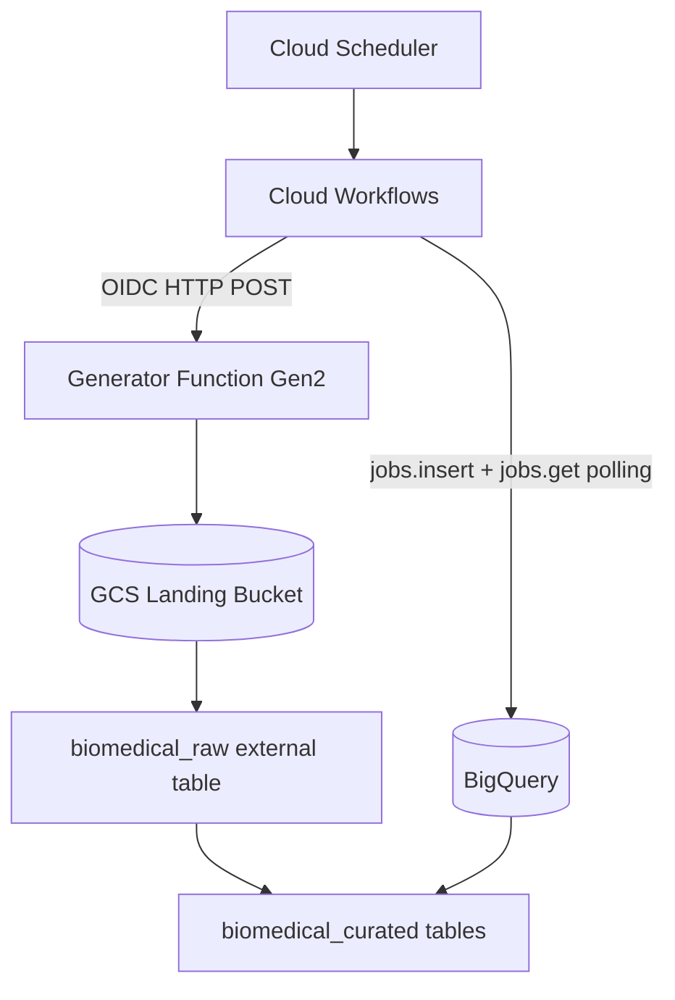

# Terraform-based Biomedical Sample Data Pipeline on Google Cloud

## Overview

This project provisions an end-to-end biomedical sample pipeline on Google Cloud using Terraform.
The infrastructure is fully managed with terraform and demonstrates orchestration using Cloud Scheduler, Cloud Workflows, Cloud Functions Gen2, Cloud Storage and BigQuery.

Main flow:

1. Cloud Scheduler triggers a Cloud Workflow.
2. Workflow invokes the authenticated sample generator (Cloud Functions Gen2 / Cloud Run backend).
3. Generator writes NDJSON files to the landing bucket under the configured object prefix.
4. Workflow submits a BigQuery query job for warehouse loading.
5. Workflow polls the BigQuery job until completion and fails on job errors.

## Features

- End-to-end orchestration with Cloud Scheduler + Cloud Workflows
- Authenticated function invocation (OIDC)
- Synthetic biomedical sample generation with realistic profile ranges
- NDJSON landing files in Cloud Storage (partitioned object paths)
- BigQuery raw external table over landing objects
- Curated tables for validated/rejected samples, QC summary, and audit history
- BigQuery job completion polling with timeout and explicit failure handling
- Terraform-managed IAM and API enablement

## Tech Stack

- Infrastructure as Code: Terraform (HashiCorp), Google Provider
- Cloud Compute: Cloud Functions Gen2 (Cloud Run-backed)
- Orchestration: Cloud Workflows
- Scheduling: Cloud Scheduler
- Storage: Google Cloud Storage
- Analytics/Data Warehouse: BigQuery
- Runtime Language: Python 3.12 (generator function)
- Testing: pytest
- Formatting/Linting: Ruff

## Prerequisites

- Terraform >= 1.0
- Google Cloud project with billing enabled
- Access to configure Terraform backend in Google Cloud Storage
- Permissions to create and manage:
  - IAM service accounts and role bindings
  - Cloud Storage buckets
  - Cloud Functions Gen2 / Cloud Run service IAM
  - BigQuery datasets and tables
  - Cloud Workflows and Cloud Scheduler resources

Recommended local tools:

- gcloud CLI (for authentication and manual verification)
- Python environment for optional local tests

## Architecture



## Terraform Modules

- modules/iam: runtime service account and project-level roles
- modules/generator: landing/archive buckets and generator function
- modules/warehouse: raw/curated datasets, table schemas, load SQL template
- modules/orchestration: workflow definition and pipeline execution logic
- modules/scheduler: scheduled workflow trigger

## Repository Structure

```text
.
├── backend.tf
├── main.tf
├── outputs.tf
├── variables.tf
├── terraform.tfvars
├── terraform.tfvars.example
└── modules
  ├── generator
  │   ├── main.tf
  │   ├── outputs.tf
  │   ├── variables.tf
  │   └── function
  │       ├── main.py
  │       ├── generator.py
  │       ├── models.py
  │       ├── writer.py
  │       ├── config.py
  │       └── tests
  ├── iam
  ├── orchestration
  ├── scheduler
  └── warehouse
    ├── main.tf
    ├── load.sql.tftpl
    └── schemas
```

## Configuration

Root input variables:

- project_id
- region
- prefix
- object_prefix (default: samples)
- schedule
- time_zone

Example values are in terraform.tfvars.example.

## Remote State

The backend is configured as GCS in backend.tf.

Initialize with your backend settings, for example:

```bash
terraform init -backend-config="bucket=gcp-coe-poc-tf-state" -backend-config="prefix=zkul/poc0"
```

## Deploy

```bash
terraform init
terraform plan
terraform apply
```

## How Pipeline Execution Works

1. Scheduler calls the Workflows Executions API endpoint.
2. Workflow sets trigger (defaults to manual if missing).
3. Workflow calls the generator endpoint using OIDC auth.
4. Workflow submits the warehouse SQL via BigQuery jobs.insert with Standard SQL.
5. Workflow polls the BigQuery job with jobs.get until status.state is DONE.
6. Workflow raises an error if errorResult is present.
7. Workflow returns SUCCESS with generator metadata and final BigQuery job status.

## What the Function Generates

The generator creates synthetic biomedical laboratory sample records and writes them as NDJSON.

Each run:

- creates a single batch ID shared by all generated samples in that run
- generates sample IDs in the format BATCH-...-SMP-0001
- simulates sample source and analyte combinations (BLOOD/TISSUE/SALIVA and DNA/RNA)
- generates operational fields (operator_id, collection and processing timestamps)
- generates quality-related measurements (cell_count, viability_percent, assay, concentration, volume, total_yield_ng, rin_score, storage_temperature)
- computes qc_status (PASS/FAIL) and qc_failure_reason
- stamps source_file and ingestion_timestamp before upload

Output payload format:

- newline-delimited JSON (NDJSON)
- uploaded under object_prefix using a partitioned path pattern
- includes a small preview in the HTTP response when invoked through the workflow

## Useful Outputs

- function_url
- landing_bucket_name
- archive_bucket_name
- service_account_email
- scheduler_job_name
- workflow_name

## Validation

Use the following checks after changes:

```bash
terraform fmt -recursive
terraform validate
```

Python unit tests for generator components are available under modules/generator/function/tests.

## Notes

- Infrastructure is fully Terraform-managed.
- API enablement is gated via google_project_service resources in root main.tf.
- BigQuery read/write access is split at dataset level (raw reader, curated editor).
- Workflow invocation uses a dedicated service account and explicit invoker permissions.